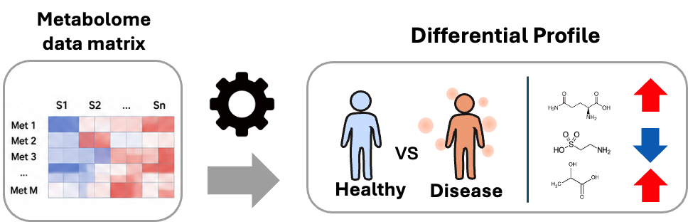

# integMET Documentation

Welcome to the documentation for **integMET**, an integrated metabolomics database.

## What is integMET?

integMET is a database that integrates metabolomics data from public repositories and makes them comparable across studies.

The key feature is the **Differential Profile (DiffProf)** — a standardized representation of metabolite changes between two biological conditions. By converting diverse metabolomics studies into DiffProfs, integMET enables cross-study discovery and reuse.

## Get Started

**→ [Quick Start Guide](quickstart.md)** — Learn how to use integMET in 5 minutes

## Learn More

| Section | Description |
|---------|-------------|
| [Quick Start](quickstart.md) | How to navigate and use integMET |
| [Concepts](concepts.md) | Core ideas behind Differential Profiles |
| [Data Model](data_model/overview.md) | How Studies, DiffProfs, and Metabolites relate |
| [Tutorial](tutorial/network_visualization.md) | Network visualization guide |

## Database Statistics

- **28,493** Metabolites
- **3,871** Studies
- **1,204** Pathways
- **12** Species
