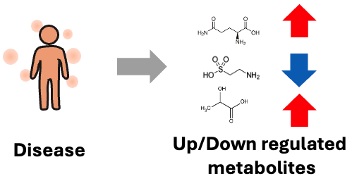
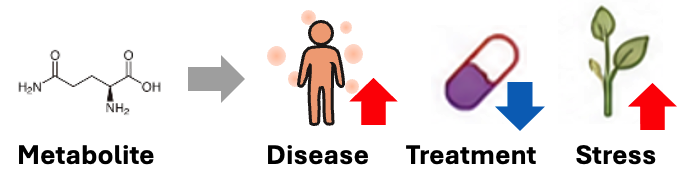

# Quick Start

This guide helps you get started with integMET in a few minutes.

## What You Can Do

- **Explore Differential Profiles** — Browse biological comparisons (e.g., control vs. disease) together with metabolic changes
- **Find Metabolites** — Search for specific metabolites and trace their changes across studies
- **Browse Studies** — Find metabolomics studies by condition, disease, or species

## Example Workflows

### Workflow A: Start from a Condition

*"I'm interested in a disease or condition — what metabolites change?"*

*"I'm interested in the effect of a drug — what metabolites change?"*

1. Go to **Diff Profiles**
2. Browse or search for DiffProfs to your interest.
3. Click a DiffProf to see its details
4. Examine the **Top Hits** — metabolites with significant changes

### Workflow B: Start from a Metabolite

*"I have a metabolite of interest — in which biological event/condition does it change?"*

1. Go to **Metabolites**
2. Find your metabolite by name or identifier
3. Click to view its detail page
4. See **Observed in differential profiles** — where this metabolite changed significantly.

### Workflow C: Start from a Study

*"I'm interested in this study — what kind of metabolic change can be seen?"*

1. Go to **Studies**
2. Find a study of interest
3. Click to view its detail page
4. See **Differential profiles** — the list of DiffProfs derived from this study data
5. Click a DiffProf to see its metabolic changes

## Understanding the Data

### Reading a DiffProf

When you view a Differential Profile, you'll see:

| Field | Meaning |
|-------|---------|
| **Group A vs Group B** | The two conditions being compared |
| **Significant Features** | Number of metabolites with significant changes |
| **Top Hits** | List of changed metabolites |
| **Ratio** | Fold-change (>1 = increased, <1 = decreased in Group B) |
| **Direction** | `up` or `down` in Group B relative to Group A |

### Reading a Metabolite Page

When you view a Metabolite, you'll see:

| Field | Meaning |
|-------|---------|
| **InChIKey** | Unique chemical identifier |
| **Studies Observed** | All studies where this metabolite was detected |
| **DiffProfs with Variation** | DiffProfs where this metabolite changed significantly |

## Tips

- **Start broad, then narrow down** — Browse studies first, then drill into specific DiffProfs
- **Use metabolites as links** — A metabolite connects multiple studies and conditions
- **Look for patterns** — If a metabolite changes across multiple DiffProfs, it may indicate a common biological response

## Next Steps

- Read [Concepts](concepts.md) to understand Differential Profiles in depth
- Explore the [Data Model](data_model/overview.md) to understand how data is organized
- Learn about [Network Visualization](tutorial/network_visualization.md) to find similar DiffProfs
